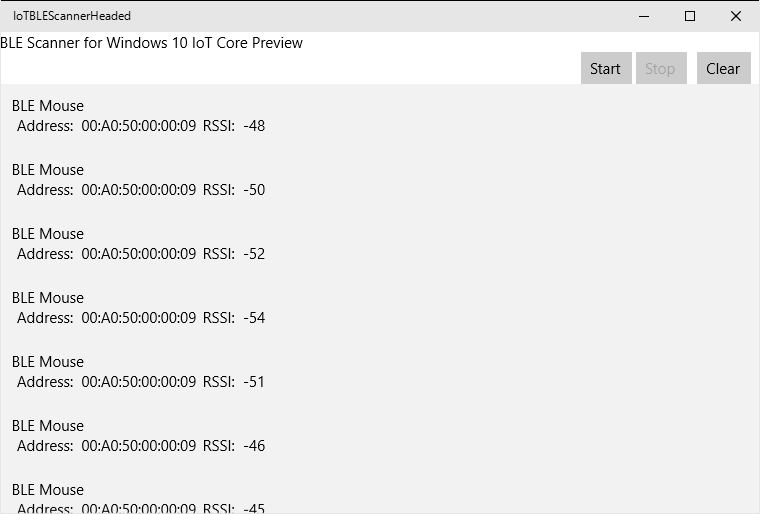

# Win10IoTBLEScanner
BLE advertisement scanner on Windows 10 IoT Core

## Requirements
* Visual Studio 2015 RTM
* RPi2 with Windows 10 IoT Core
	- or A Windows 10 build 10586 or above installed device
* An USB Bluetooth dongle which supports Bluetooth Low Energy
	- Confirmed with a dongle which uses Broadcomm BCM20702 chip on Win10 IoT Core Public Release
	- Confirmed with Buffalo BSBT4D09BK dongle on Win10 IoT Core Insider Preview build at Sep.25'2015.

## Install Drivers To BCM20702 USB Dongle

### Warning
This instruction is now *obsolete* and can not install the driver correctly at Win10 IoT Core Insider Preview.
You should use a dongle which operates normally without this instruction such as Buffalo BSBT4D09BK.

Skip this section if you are using an USB dongle with other chip or you have already installed drivers to an USB dongle with BCM20702.

DISCLAIMER: I do not assume any responsibilities for any results by following this instruction.

* Check VID and PID of your USB dongle.
    - Run `devcon status USB\*` in remote PowerShell session.
* Build "BLEDriverInfPatch" project by VS2015.
* Run "BLEDriverInfPath" with arguments below.
    - the computer name of RPi2
    - VID
    - PID
    - e.g. `BLEDriverInfPath win10iot 0A5C 21EC`
        + computer name = "win10iot"
        + VID = "0A5C"
        + PID = "21EC" 
* Copy generated "BCM20702.inf" to somewhere in RPi2.
    - e.g. `\\ComputerName\C$\BCM20702.inf`
* Update drivers with devcon.
    * Run the command below on RPi2
        `devcon updateni C:\BCM20702.inf 'DeviceNameOfYourDongle'`

## Run Application From Visual Studio
* Connect a RPi2 to local network.
* Open the property page of IoTBLEScannerHeaded in VS2015.
* Select "ARM" in the Solution platform dropdown listbox.
* Select *Debug* tab and set "Target device" to "Remote computer."
* Input the computer name of the RPi2 to the "Remote machine:" text box.
* Uncheck the "Use authentication" checkbox.
* Press "F5" or select "Debug - Start debug"

## Usage
* Press the "Start" button on the upper-right corner in the screen.
* Turn on a BLE device and make it advertising state.
* A list of advertisements will be shown.

